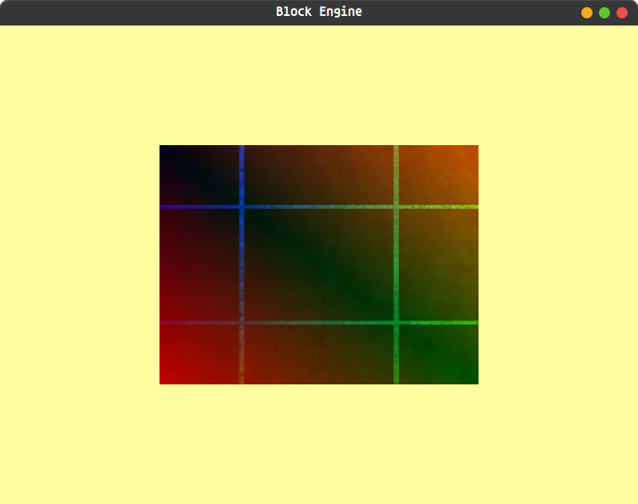

# Block Engine

**A lightweight game engine built to keep game development simple without taking control away from the developer.**

## What is Block Engine?

Block Engine is a custom made game engine written in **C++ and C**.

Block Engine provides a simple interface for building games through **its C and C++ API**, while still giving developers control over the engine.

---

## Preview

---

## Current Features

* Window creation and management
* OpenGL rendering
* Basic shape rendering
* Keyboard input and key events
* Audio
* Logging and debugging utilities
* C and C++ API
* Linux support

---

## API

Block Engine is built API first: the core runtime is simply a thin wrapper around a modular C and C++ API.

---

## Vision

Block Engine is made for developers who want useful abstractions without being locked away from the systems underneath.

---

## Development Status

Block Engine is currently in **Alpha 0.68** and is actively being developed.

It is an early stage project so the APIs and features may change, break, or be replaced as development continues.

---

## 🗺️ Roadmap

The roadmap will evolve as the engine develops.

### Core

* [x] Window management
* [x] Input handling
* [x] Basic rendering
* [x] Audio
* [x] Logging

### 2D

* [x] Basic shapes
* [x] Texture system
* [ ] Sprite rendering
* [ ] 2D camera system
* [ ] Text rendering

### 3D

* [ ] 3D rendering
* [ ] 3D model support
* [ ] Camera system
* [ ] Materials
* [ ] Lighting

### Platforms

* [x] Linux
* [ ] Windows

---

## 🛠️ Built With

Block Engine currently uses:

* **C++**
* **C**
* **OpenGL**
* **GLFW**
* **GLAD**
* **miniaudio**
* **stb**

---

## Contributing

You can help me by writing code and reporting bugs.

---

## Discord

**[Join the Block Engine Discord](https://discord.gg/7Y6rtN9wu7)**

---

## License

Block Engine is distributed under the **Block Engine License**.

You are free to:

* Use Block Engine
* Study Block Engine
* Modify Block Engine
* Fork Block Engine
* Create and freely share Modified Engines
* Build and commercially distribute Products made with Block Engine
* Create and sell independently developed plugins, extensions, tools, assets, and other software
* Create software that works with, extends, integrates with, or competes with Block Engine
* Use Block Engine internally within a company

You may **not** commercially provide Block Engine or a Modified Engine itself as development technology.

This includes commercially selling, licensing, renting, leasing, hosting, remotely providing, or otherwise offering the engine or its development functionality to developers.

The complete legal terms are available in `LICENSE.md`.

> **Important:** This section is only a plain language summary. It does not replace, modify, expand, restrict, override, or otherwise alter the Block Engine License. The Block Engine License is the controlling legal document and takes precedence over this summary in all circumstances.

---

## About

Block Engine is a personal open source game engine project built from the ground up with a focus on **simplicity, control, and learning**.

Thanks for checking out my Engine!

---

## AI Use

Yes i use ai **BUT** i only use it to:
 * Explane bits of code i find undocumented or poorly documented
 * To make comments because it's faster than me
 * to read walls of errors in compile time to tell me where they happend then **i fix them**

