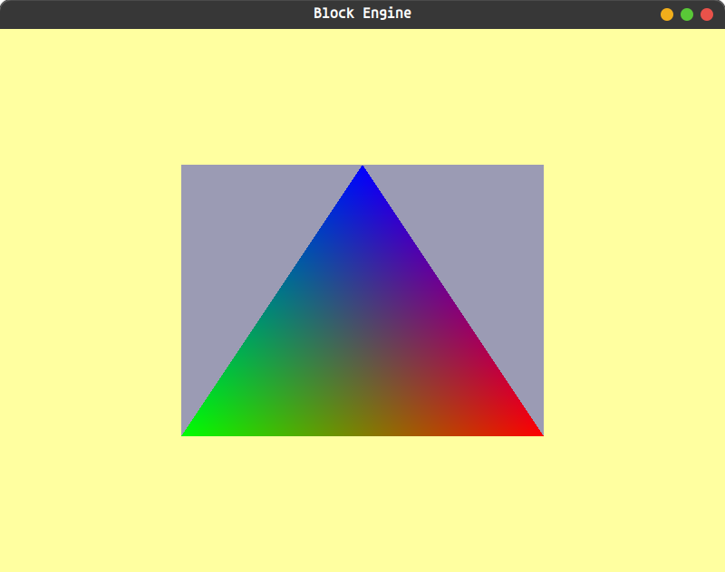

# 🧱 Block Engine

**A lightweight game engine built to keep game development simple without taking control away from the developer.**

> **Simplicity when you want it. Control when you need it.**

🚧 **Block Engine is currently in Alpha 0.6 and under active development.**

## 🎮 What is Block Engine?

Block Engine is a custom-made game engine written in **C++ and C**, currently targeting **Linux**.

Block Engine provides a simple interface for building games through **its C and C++ API**, while still giving developers control over the engine.

The project is focused on building the core systems needed for **2D and 3D game development**.

---

## Preview



---

## ✨ Current Features

* 🖥️ Window creation and management
* 🎨 OpenGL rendering
* 🔺 Basic shape rendering
* 🎮 Keyboard input and key events
* 🔊 Audio playback
* 📝 Logging and debugging utilities
* 🎯 C and C++ API
* 🐧 Linux support

---

## 💻 Example

A basic Block Engine program currently looks like this:

```cpp
#include "BlockEngine.hpp"// we include this because we need it :D

// Hover over functions/classes to see they works.

int main() {
    // here we initialize the (Logger, Window, Input, Audio) and set the exit key.
    InitializeBlockEngine(800, 600, "Block Engine", BLOCK_KEY_ESCAPE, DEFAULT_MASTER_VOLUME);

    {
        // Audio objects can be used for any object that needs audio.
        Audio AudioObject[2];

        AudioObject[0].LoadSound("src/Assets/BlockEngine/Audio/StartUp/start.mp3", DEFAULT_VOLUME, false, DEFAULT_PITCH);
        AudioObject[1].LoadSound("src/Assets/BlockEngine/Audio/Sounds/Correct.mp3", DEFAULT_VOLUME, false, DEFAULT_PITCH);
        
        Triangle MyTriangle(Color(180,180,180));
        Square MySquare(Color(155,155,180));

        info("Entering Game Loop");
        while (!WindowShouldClose())
        {
            UpdateWindow();
            if(KeyEvent(BLOCK_KEY_F,BLOCK_PRESS))
            {
                AudioObject[0].PlaySound();
            }
            if(KeyEvent(BLOCK_KEY_G,BLOCK_RELEASE))
            {
                AudioObject[1].PlaySound();
            }
            if(KeyEvent(BLOCK_KEY_H,BLOCK_REPEAT))
            {
                AudioObject[1].PlaySound();
            }
            BackGroundColor(Color(255,255,160), 255);
            MySquare.DrawSquare();
            MyTriangle.DrawTriangle();
        }
        info("Closed Window");
        info("Exited Game Loop");
    }

    ShutdownBlockEngine();
    return 0;
}
```

---

## 🧭 Vision

Block Engine is made for developers who want useful abstractions without being locked away from the systems underneath.

But if you want to understand, modify, or work directly with the lower-level systems, you should be able to.

---

## 🚧 Development Status

Block Engine is currently in **Alpha 0.6** and is actively being developed.

It is an early-stage project, so APIs and features may change, break, or be replaced as development continues.

### Current Platform

* 🐧 **Linux** — Supported

### Planned Platform Support

* 🪟 **Windows** — Planned for consideration after 2D and 3D support

The long-term goal is to support both **2D and 3D** game development.

Current development is focused on building the core engine and gradually expanding its capabilities.

---

## 🗺️ Roadmap

The roadmap will evolve as the engine develops.

### Core

* [x] Window management
* [x] Input handling
* [x] Basic rendering
* [x] Audio
* [x] Logging

### 2D

* [x] Basic shapes
* [ ] Texture system
* [ ] Sprite rendering
* [ ] 2D camera system
* [ ] Text rendering

### 3D

* [ ] 3D rendering
* [ ] 3D model support
* [ ] Camera system
* [ ] Materials
* [ ] Lighting

### Platforms

* [x] Linux
* [ ] Windows

> The roadmap is not a promise or a fixed schedule. Features may be changed, removed, or added as development continues.

---

## 🛠️ Built With

Block Engine currently uses:

* **C++**
* **C**
* **OpenGL**
* **GLFW**
* **GLAD**
* **miniaudio**
* **stb**

---

## ❤️ Contributing

Contributions to Block Engine are welcome!

* ⭐ Star the repository
* 🐛 Report bugs
* 💡 Suggest features and improvements
* 💻 Contribute code
* 📢 Share Block Engine with others

Before making major changes, please open an issue to discuss them first. 🚀

---

## 📜 License

Block Engine is distributed under the **Block Engine License**.

You are free to:

* Use Block Engine
* Study Block Engine
* Modify Block Engine
* Fork Block Engine
* Create and freely share Modified Engines
* Build and commercially distribute Products made with Block Engine
* Create and sell independently developed plugins, extensions, tools, assets, and other software
* Create software that works with, extends, integrates with, or competes with Block Engine
* Use Block Engine internally within a company

You may **not** commercially provide Block Engine or a Modified Engine itself as development technology.

This includes commercially selling, licensing, renting, leasing, hosting, remotely providing, or otherwise offering the engine or its development functionality to developers.

The complete legal terms are available in `LICENSE.md`.

> **Important:** This section is only a plain-language summary. It does not replace, modify, expand, restrict, override, or otherwise alter the Block Engine License. The Block Engine License is the controlling legal document and takes precedence over this summary in all circumstances.

---

## 🧱 About

Block Engine is a personal open-source game engine project built from the ground up with a focus on **simplicity, control, and learning**.

Thanks for checking out Block Engine! ❤️
